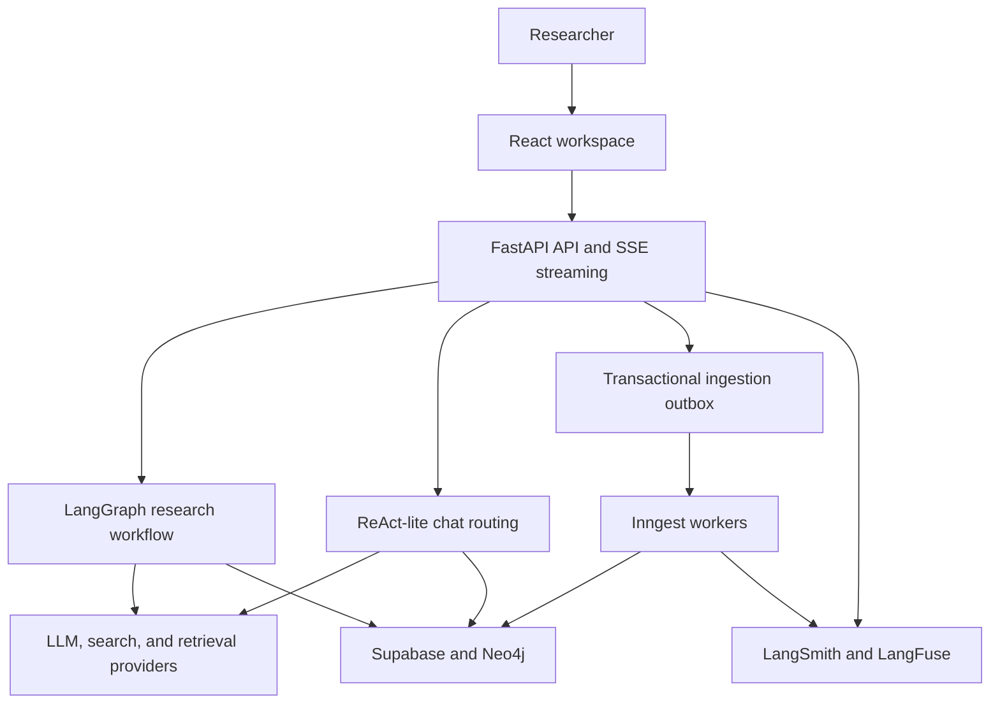

# Cortex

[](https://github.com/KostasCherv/cortex/actions/workflows/ci.yml)
[](pyproject.toml)
[](LICENSE)

**A production-oriented AI research platform for multi-step web research, source-grounded chat, and reliable document ingestion.**

Cortex combines LangGraph orchestration, GraphRAG retrieval, durable background jobs, and end-to-end observability in a FastAPI and React application.

<video src="https://github.com/user-attachments/assets/fe5c280c-bbdc-4d49-8e9c-655a256b6b6f" controls></video>


## Why Cortex

Most RAG demos stop at a single retrieval-and-generation call. Cortex treats research as a long-running, stateful workflow: it searches and retrieves sources, enriches them with graph context, reranks evidence, streams progress, produces a structured report, and keeps the result available for grounded follow-up conversation.

The surrounding system is designed for production failure modes as well as the happy path:

- Explicit LangGraph routes distinguish successful, empty, aborted, and failed execution.
- A schema-validated ReAct-lite router chooses between direct answers, local RAG, web search, URL fetching, and clarification.
- A transactional outbox and idempotent workers make asynchronous document ingestion resilient to retries and process crashes.
- Session-scoped authorization isolates research history, uploads, and retrieved context between users.
- Tracing, evaluation gates, load tests, health probes, security scans, and an SBOM make behavior measurable and releases auditable.

## Measured performance

Measured in July 2026 with k6 against the live Cloud Run deployment and with an isolated local agent-loop benchmark:

| Workload | Result |
|---|---|
| Agent-loop turn with a real LLM call | 1.2 s median, 2.0 s p95 |
| Production API load | 13,197 requests at up to 200 req/s, 0% errors |
| Per-IP rate limiting | Exactly 60 of 70 concurrent requests admitted; the remainder returned HTTP 429 |

LLM latency dominates agent-loop time; measured framework overhead is in the single-digit milliseconds. See the [full methodology, results, and caveats](reports/benchmarks/LOAD_TEST_REPORT.md).

## How it works



The research graph, chat routing policy, ingestion lifecycle, and major engineering decisions are documented in [Architecture](docs/architecture.md).

## Quickstart

### Prerequisites

- Python 3.11+ and [uv](https://docs.astral.sh/uv/)
- Node.js and npm
- Docker
- An LLM provider key
- Supabase credentials for authenticated, session-scoped chat and RAG

```bash
uv sync
cp .env.example .env
docker compose up -d
uv run uvicorn src.api.endpoints:app --host 0.0.0.0 --port 8010 --reload
```

In another terminal, start the UI:

```bash
cd ui
npm install
npm run dev
```

The API runs at `http://localhost:8010` and the UI at `http://localhost:5173`. The default Docker services provide Redis and Neo4j. See [Getting started](docs/getting-started.md) for provider settings, GraphRAG configuration, and background workers.

## Signature capabilities

- **Stateful research orchestration** — explicit success, empty, and failure paths across search, retrieval, graph context, reranking, summarization, and reporting.
- **Streaming execution** — SSE progress and report events keep long-running workflows responsive.
- **Grounded follow-up chat** — per-run source chunks and session attachments remain scoped to the correct user and conversation.
- **Model-directed tool routing** — validated decisions across direct response, RAG, web search, URL fetch, and clarifying turns.
- **Reliable asynchronous ingestion** — atomic resource/job/outbox creation, retryable dispatch, and idempotent worker claims.
- **Evaluation-driven AI quality** — deterministic routing and citation contracts in CI, plus optional DeepEval and DSPy workflows.

## Production readiness

| Area | Implementation |
|---|---|
| Delivery | Approval-gated GitHub Actions deployment to Cloud Run; Vercel Git deployment for the UI |
| Supply chain | Trivy repository and image scanning, Dependabot, and a retained CycloneDX SBOM |
| Runtime safety | Separate liveness/readiness probes, dependency timeouts, smoke tests, and revision rollback instructions |
| Quality | Ruff, blocking mypy, pytest coverage, ESLint, UI coverage, and a Playwright browser journey |
| AI behavior | A credential-free 20-case regression gate requiring 100% across routing, provenance, and tool planning |
| Observability | LangSmith traces, LangFuse generation telemetry, opt-in Sentry error capture, and a [documented Cloud Run monitoring and alerting policy](docs/observability.md#production-monitoring) |

Read the [deployment runbook](docs/deployment.md), [testing and quality guide](docs/testing-and-quality.md), and [observability guide](docs/observability.md) for operational details.

## Technology

| Layer | Technologies |
|---|---|
| Orchestration and API | LangGraph, FastAPI, Uvicorn, Server-Sent Events |
| Models and tools | LangChain, OpenAI, OpenRouter, Ollama, Tavily, Alpha Vantage MCP |
| Retrieval | Neo4j GraphRAG, Cohere reranking, BeautifulSoup, httpx |
| Data and jobs | Supabase Postgres/Auth/Storage, Redis, Inngest |
| Frontend | React 19, Vite, TypeScript |
| Evaluation and operations | pytest, mypy, Ruff, Playwright, DeepEval, DSPy, k6, Trivy, LangSmith, LangFuse |
| Hosting | Google Cloud Run, Secret Manager, Vercel |

## Documentation

| Guide | Purpose |
|---|---|
| [Getting started](docs/getting-started.md) | Complete local setup, environment configuration, and worker startup |
| [Architecture](docs/architecture.md) | Research, chat, ingestion, GraphRAG, and key design decisions |
| [Production deployment](docs/deployment.md) | Cloud Run, Vercel, Inngest, migrations, smoke checks, and rollback |
| [Production configuration](docs/env-vars-production.md) | Production environment variables and secrets |
| [Billing](docs/billing.md) | Stripe variables, webhook setup, and subscription flow |
| [Observability](docs/observability.md) | LangSmith, LangFuse, health signals, and benchmark dashboards |
| [Testing and quality](docs/testing-and-quality.md) | Local checks, CI gates, coverage, security, and load testing |
| [Model evaluation](docs/model-evaluation.md) | Regression data, DeepEval comparisons, and DSPy optimization |
| [Router fine-tuning](docs/router-fine-tuning.md) | Experimental Qwen/Unsloth training and activation pipeline |
| [Agent tooling](docs/agent-tooling.md) | Repository guidance for coding agents and Graphify usage |
| [UI design system](ui/DESIGN.md) | Components, themes, variants, and frontend conventions |

## License

MIT — see [LICENSE](LICENSE).
