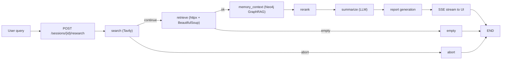
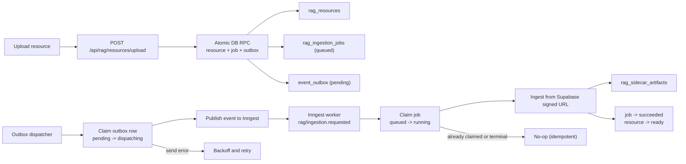
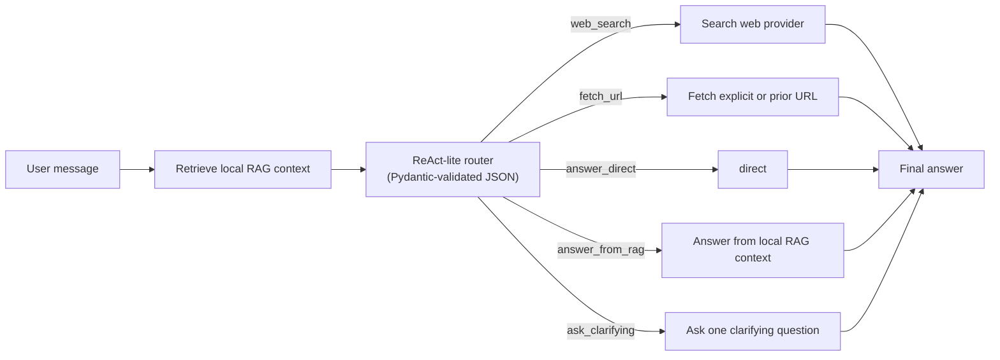
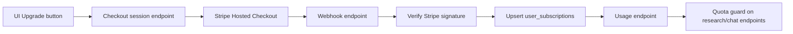

# Cortex

Production-grade AI research and RAG orchestration platform built with LangGraph, FastAPI, Inngest, and Supabase.


## What it does

Cortex runs multi-step web research workflows, streams progress in real time, generates structured reports, and supports grounded follow-up chat over retrieved sources. Chat now uses a ReAct-lite router so the model decides whether to answer directly, use local RAG context, search the web, fetch a URL, or ask a clarifying question. It also includes a reliable asynchronous ingestion pipeline for user-uploaded RAG resources.

## Signature capabilities

- Stateful LangGraph orchestration with explicit routing for success, empty, and failure paths.
- Streaming research execution over SSE for responsive UX during long-running workflows.
- Session-scoped research history and follow-up chat grounded to per-run source chunks.
- ReAct-lite chat routing with schema-validated model decisions across direct answers, RAG, web search, URL fetch, and clarifying turns.
- Durable ingestion pipeline with transactional outbox, dispatcher, and idempotent workers.
- End-to-end observability with trace spans across graph nodes and external dependencies.

## Stack and tools

- Orchestration: `LangGraph`
- API and streaming: `FastAPI`, `Uvicorn`, Server-Sent Events (SSE)
- LLM and agent layer: `LangChain`, `DSPy`, `OpenAI`, `OpenRouter`, `Ollama`
- Model fine-tuning: `Unsloth` (LoRA/QLoRA), `Hugging Face` (`datasets`, `Hub`), `Qwen2.5-3B-Instruct` router, GGUF + `Ollama` serving
- Web research and parsing: `Tavily`, `httpx`, `BeautifulSoup`
- Market data tools: `Alpha Vantage MCP`, `yfinance`
- Retrieval and reranking: `Neo4j` (GraphRAG), `Cohere`
- Async jobs and event delivery: `Inngest`, transactional outbox dispatcher
- Auth, sessions, and storage: `Supabase` (Postgres, Auth, Storage)
- Caching: `Redis` (optional for auth, search, and session hot paths; graceful degradation when unavailable)
- Frontend: `React 19`, `Vite`, `TypeScript`, `react-markdown`
- Observability: `LangSmith`, `LangFuse`
- Billing: `Stripe` (subscriptions, webhooks, customer portal)
- Quality tooling: `pytest`, `ruff`, `mypy`, `ESLint`, `DSPy` (prompt optimization)

## Architecture

### Research execution flow



### Reliable ingestion flow (outbox pattern)



### Chat routing flow



### Chat routing policy

- Greetings, acknowledgements, thanks, and other social turns are routed by the model and should normally resolve to `answer_direct`.
- Weak or empty RAG context is only an input to the router. It no longer auto-triggers web search.
- Web search is used only when the model decides the request needs external, fresh, current, or otherwise web-dependent information.
- URLs in the message or history are treated as available context, not as an automatic fetch.
- Direct URL fetching happens only when the router decides inspecting that resource is necessary.
- The same routing behavior is used across agent chat, workspace chat, and both streaming and non-streaming endpoints.

## Run locally

### 1. Install dependencies and configure environment

```bash
uv sync
cp .env.example .env
```

`arxiv-mcp-server` is installed as part of the backend dependencies. The API launches it over `stdio` when needed, so you do not run a separate arXiv service or background process.

### 2. Start local services (Redis + Neo4j)

```bash
docker compose up -d
```

This starts:
- **Redis** on `localhost:6379`
- **Neo4j** on `localhost:7687` (Browser UI at `http://localhost:7474`, login: `neo4j` / `devpassword`)

The Neo4j schema (indexes and constraints) is bootstrapped automatically on first backend startup.

### 3. Configure `.env`

Relevant LLM settings:

- `LLM_PROVIDER=openai|openrouter|ollama`
- `OPENAI_API_KEY` and `OPENAI_MODEL` for direct OpenAI usage
- `OPENROUTER_API_KEY` and `OPENROUTER_MODEL` for OpenRouter-hosted models
- `OLLAMA_BASE_URL` and `OLLAMA_MODEL` for local Ollama usage

Asset pricing settings:

- `ASSET_PRICE_PROVIDER=alphavantage_mcp|yfinance`
- `ALPHA_VANTAGE_API_KEY` for the default Alpha Vantage MCP-backed market data provider
- `ALPHA_VANTAGE_MCP_TOOL_REFRESH_SECONDS` to control how often the in-memory MCP tool catalog is refreshed
- Optional `ALPHA_VANTAGE_MCP_URL` to override the full remote MCP URL directly

Embedding settings (must match the Neo4j vector index dimensions):

- Local dev default: `EMBEDDING_PROVIDER=ollama`, `EMBEDDING_MODEL=nomic-embed-text`, `EMBEDDING_DIMENSIONS=768`
- To share the production Neo4j: switch to `EMBEDDING_PROVIDER=openai`, `EMBEDDING_MODEL=text-embedding-3-small`, `EMBEDDING_DIMENSIONS=1536`

Neo4j (local Docker):
```
NEO4J_URI=bolt://localhost:7687
NEO4J_USERNAME=neo4j
NEO4J_PASSWORD=devpassword
NEO4J_DATABASE=neo4j
```

Redis:
```
REDIS_URL=redis://localhost:6379/0
```

### 4. Start backend API

```bash
uv run uvicorn src.api.endpoints:app --host 0.0.0.0 --port 8000 --reload
```

Backend startup now validates that `arxiv-mcp-server` is available in the same runtime environment. If it is missing or cannot load its tools, startup fails immediately instead of disabling arXiv silently.

### 5. Start frontend UI

```bash
cd ui
npm install
npm run dev
```

### 6. Start event and ingestion workers

```bash
npx --ignore-scripts=false inngest-cli@latest dev -u http://127.0.0.1:8000/api/inngest --no-discovery
```

The Inngest dev server fires the `outbox-dispatcher` cron automatically every 2 minutes. No separate dispatcher process is needed locally.

To flush the outbox manually on demand:

```bash
uv run python scripts/dispatch_outbox.py --limit 100
```

## Production deployment

### Backend — Google Cloud Run

The backend runs on Cloud Run with secrets stored in Google Secret Manager.

```bash
./scripts/deploy.sh
```

This script:
1. Builds a Docker image via Cloud Build and tags it with the current git SHA
2. Tags the image as `:latest`
3. Injects the SHA-tagged image into `cloudrun/service.yaml` and runs `gcloud run services replace`

The service manifest at `cloudrun/service.yaml` defines all environment variables. Sensitive values reference Secret Manager secrets via `valueFrom.secretKeyRef`.

Key production settings in `service.yaml`:
- `EMBEDDING_PROVIDER=openai`, `EMBEDDING_MODEL=text-embedding-3-small`, `EMBEDDING_DIMENSIONS=1536`
- `NEO4J_DATABASE` must be set to your Aura instance database name (not `neo4j`)
- `CORS_ORIGINS` must be a JSON array string: `'["https://your-app.vercel.app"]'`
- `LANGSMITH_TRACING=true` with `LANGSMITH_API_KEY` secret

### Frontend — Vercel

```bash
# Sync VITE_* env vars to Vercel
./scripts/vercel-ui-env.sh

# Deploy to production
./scripts/deploy-ui.sh --prod
```

### Background jobs — Inngest

After deploying the backend, sync the Inngest serve URL in the Inngest Dashboard:

- **Apps → Sync → Serve URL:** `https://<your-cloud-run-url>/api/inngest`

Registered functions:
- `rag-ingestion` — triggered by `rag/ingestion.requested`
- `research-run` — triggered by `research/run.requested`
- `outbox-dispatcher` — cron every 2 minutes

### Supabase migrations

```bash
npx supabase link --project-ref <project-ref>
npx supabase db push
```

## Stripe configuration

### Environment variables

- `STRIPE_SECRET_KEY`
- `STRIPE_WEBHOOK_SECRET`
- `STRIPE_PRO_PRICE_ID`
- `STRIPE_SUCCESS_URL`
- `STRIPE_CANCEL_URL`
- `STRIPE_PORTAL_RETURN_URL`

### Webhook setup

Register the webhook endpoint in the Stripe Dashboard → Developers → Webhooks:

- **URL:** `https://<your-cloud-run-url>/api/billing/webhook`
- **Events:** `checkout.session.completed`, `customer.subscription.created`, `customer.subscription.updated`, `customer.subscription.deleted`

The signing secret from the Stripe Dashboard must match `STRIPE_WEBHOOK_SECRET` in Secret Manager.

### Billing flow



## Neo4j / GraphRAG

Cortex uses Neo4j as a graph-aware vector store for RAG retrieval.

### Local vs production

| | Local dev | Production |
|---|---|---|
| Instance | Docker (`bolt://localhost:7687`) | Neo4j Aura (`neo4j+s://...`) |
| Database | `neo4j` | Your Aura database name |
| Embedding model | `nomic-embed-text` (Ollama) | `text-embedding-3-small` (OpenAI) |
| Vector dimensions | 768 | 1536 |

The two environments use separate databases and indexes — local ingestion does not affect production data.

> **Note:** The local and production Neo4j instances are incompatible for queries because they use different embedding dimensions. Do not point local dev at the production Aura instance unless you also switch to OpenAI embeddings locally.

### Schema bootstrap

On first connection, the backend automatically creates:
- Vector index `chunk_embedding_index` on `Chunk.embedding`
- B-tree indexes on `Chunk.run_id`, `Document.resource_id`, `Entity.normalized_name`

## Graphify (codebase knowledge graph)

This repo includes a [Graphify](https://github.com/safishamsi/graphify) map at `graphify-out/` — nodes, edges, and communities across code and docs. Cursor, Claude Code, and Codex are configured to prefer `graphify query` over large greps when `graph.json` exists.

### Prerequisites

```bash
uv tool install graphifyy
ollama pull gemma4:31b-cloud   # semantic extraction (Ollama cloud model)
```

For graphify’s OpenAI-compatible API, set (do **not** reuse embedding URL without `/v1`):

```bash
export OLLAMA_BASE_URL=http://localhost:11434/v1
export OLLAMA_API_KEY=ollama
export GRAPHIFY_OLLAMA_MODEL=gemma4:31b-cloud
```

### Commands

| Task | Command |
|------|---------|
| Full rebuild | `./scripts/graphify-rebuild.sh` |
| Incremental (docs changed) | `./scripts/graphify-rebuild.sh --incremental` |
| Local 8B model | `./scripts/graphify-rebuild.sh --local` |
| Code-only refresh (no LLM) | `graphify update .` |
| Ask the graph | `graphify query "How does billing work?"` |
| Path between concepts | `graphify path "endpoints" "outbox"` |
| Explain a node | `graphify explain "ResearchState"` |
| Report + HTML | `graphify cluster-only .` |

Outputs: `graphify-out/graph.json`, `GRAPH_REPORT.md`, `graph.html`.

### Git hooks

```bash
graphify hook install                      # AST rebuild on code commits (upstream)
./scripts/install-graphify-post-commit.sh  # + incremental semantic on .md/.mdx commits
```

After a commit that touches markdown, the post-commit hook runs **incremental** `graphify extract` with `gemma4:31b-cloud` in the background. Log: `tail -f ~/.cache/graphify-rebuild.log`. Skip once: `GRAPHIFY_SKIP_HOOK=1 git commit`.

Re-run `./scripts/install-graphify-post-commit.sh` if you reinstall graphify hooks.

## Observability

### LangSmith

Enabled in production via `LANGSMITH_TRACING=true`. Traces appear in the configured project at [smith.langchain.com](https://smith.langchain.com).

Configuration:
- `LANGSMITH_PROJECT=cortex`
- `LANGSMITH_REDACTION_MODE=redacted_default`
- `LANGSMITH_SAMPLING_RATE=1.0`

### LangFuse

Used for generation-level observability, user scoring, and evaluation datasets. See [LANGFUSE.md](LANGFUSE.md) for details.

## Development checks

```bash
uv run pytest -v
uv run ruff check src
uv run mypy src
```

## Local benchmarking

Cortex includes a local-first k6 harness in [`load-tests/`](load-tests/README.md) for bottleneck discovery before production-like validation.

Typical flow:

```bash
mkdir -p reports/benchmarks

k6 run \
  --summary-export reports/benchmarks/health-summary.json \
  load-tests/health.js

uv run python scripts/render_k6_report.py \
  --summary-json reports/benchmarks/health-summary.json \
  --scenario health \
  --environment local-dev \
  --target "20 req/s for 1 minute" \
  --output reports/benchmarks/health-report.md
```

Additional scenarios:

- `load-tests/agent_chat.js` for authenticated agent chat pressure
- `load-tests/research.js` for research queue admission pressure

Local benchmark numbers are not production-capacity claims. Use them to find bottlenecks, tighten thresholds, and prepare the same scenarios for a production-like environment later.

## Model evaluation

The repo includes a standalone summarize-only comparison script at `src/evals/model_comparison.py`.

- Loads sample cases from `src/evals/golden_set.json`
- Runs `summarize_node` directly for each configured `{provider, model}` entry
- Scores outputs with DeepEval faithfulness and answer relevancy metrics
- Writes results to `src/evals/results.csv`

Edit `MODEL_CONFIGS` in `src/evals/model_comparison.py` to choose which models to compare, then run:

```bash
uv run python3 src/evals/model_comparison.py
```

### Prompt optimization with DSPy

Cortex uses [DSPy](https://dspy.ai) to algorithmically optimize prompt templates against the golden set — replacing manual prompt tweaking with reproducible, metric-driven iteration.

**Why this exists:** Prompt quality is the single largest lever in LLM output quality, but hand-tuning is fragile and subjective. DSPy's MIPROv2 optimizer generates better instructions and few-shot examples by searching the prompt space, scoring each candidate against a metric, and keeping what works.

**Architecture:** At `src/prompts/dspy_optimizer.py`:
- `SummarizeSignature` / `ReportSignature` — typed DSPy signatures that mirror the existing Jinja2 template inputs
- `SummarizeModule` / `ReportModule` — `dspy.Module` subclasses wrapping `ChainOfThought` for structured generation
- `DspyPromptOptimizer` — orchestrates MIPROv2: builds a training set from the golden set, runs optimization, scores before/after, and persists the optimized program

**Run optimization:**

```bash
uv run python -c "
from src.prompts.dspy_optimizer import DspyPromptOptimizer, SummarizeModule
from src.evals.model_comparison import load_golden_set

optimizer = DspyPromptOptimizer()
module = SummarizeModule()
golden = load_golden_set()
result = optimizer.optimize(module, golden, 'summarize')
print(f'Before: {result.before_score}  After: {result.after_score}  Improvement: {result.improvement}')
optimizer.save(result, 'optimized_summarize')
"
```

**Compare original vs optimized:**

```bash
uv run python -c "
from src.prompts.dspy_optimizer import DspyPromptOptimizer, SummarizeModule
from src.evals.model_comparison import load_golden_set

optimizer = DspyPromptOptimizer()
golden = load_golden_set()
results = optimizer.compare(SummarizeModule(), 'optimized_prompts/optimized_summarize.json', golden, 'summarize')
for r in results:
    print(f'{r[\"query\"][:50]:50s} orig={r[\"original_score\"]:.2f}  opt={r[\"optimized_score\"]:.2f}')
"
```

**Load and use an optimized program at inference time:**

```python
from src.prompts.dspy_optimizer import DspyPromptOptimizer, SummarizeModule

optimizer = DspyPromptOptimizer()
module = optimizer.load(SummarizeModule(), 'optimized_prompts/optimized_summarize.json')
prediction = module(query='your question', source_blocks='...', domain='')
print(prediction.summaries)
```

**Integration is opt-in** — the existing Jinja2-based prompt pipeline is the default. DSPy optimization is a separate toolchain you run when you want to improve prompt quality against a known evaluation set. The golden set lives at `src/evals/golden_set.json` — add more cases to cover more scenarios.

**Tests:**

```bash
uv run pytest tests/test_dspy_optimizer.py -v
```

## Router fine-tuning (experimental)

Cortex can offload the chat action-classification step to a small router model instead of the main "brain" model. The router is a compact base model (Qwen2.5-3B-Instruct) **fine-tuned with LoRA/QLoRA via [Unsloth](https://github.com/unslothai/unsloth)**, then exported to GGUF and served through Ollama. This path is **opt-in and inert by default** — it does not change any existing chat behavior unless explicitly enabled.

> **Note:** This "router" is a fine-tuned intent classifier and is distinct from the ReAct-lite chat routing described above. They share the word "router" but are unrelated.

### Enable the live router

Set in `.env` (all default to off / fall back to the main model):

- `ROUTER_ENABLED=true` — turn on the live router LLM call (default `false`)
- `ROUTER_LLM_PROVIDER` — provider override (`ollama|openai|openrouter|lmstudio`); empty falls back to `LLM_PROVIDER`
- `ROUTER_OLLAMA_MODEL` / `ROUTER_OPENAI_MODEL` / `ROUTER_OPENROUTER_MODEL` / `ROUTER_LMSTUDIO_MODEL` — per-provider model overrides; empty falls back to the main model

### Training pipeline

`scripts/finetune/pipeline.sh` orchestrates the data + training + activation loop around the GPU-only training step:

```bash
# 1. Regenerate the dataset (teacher labelling) and push to the HF Hub
scripts/finetune/pipeline.sh prepare

# 2. Manual GPU step: run scripts/finetune/train_unsloth.ipynb on Kaggle/Colab.
#    It pushes the LoRA adapter + GGUF to the Hub.

# 3. Download the trained GGUF, register it with Ollama, and score it
scripts/finetune/pipeline.sh activate

# Re-run held-out scoring only
scripts/finetune/pipeline.sh score
```

- `prepare` expands the action seed bank (`scripts/finetune/action_seeds.py`), labels inputs with a teacher model (Pydantic-validated), splits into stratified train/held-out sets, and pushes to the HF Hub (default `kostascherv/cortex-router-dataset`).
- `score` reports per-class accuracy, latency, and a confusion matrix vs the teacher labels.
- Defaults (`DATASET_REPO`, `GGUF_REPO`, `GGUF_FILENAME`, `OLLAMA_MODEL`) and the teacher backend (`TEACHER_API`, `TEACHER_MODEL`, `TEACHER_BASE_URL`) are overridable via environment variables.

## Best practices implemented

- Transactional outbox for exactly-once intent before external dispatch.
- Idempotent job claiming to prevent duplicate ingestion under retries.
- Concurrent-safe state transitions for outbox dispatch and ingestion jobs.
- Auth-scoped session boundaries for data isolation across users.
- Stream-first API design for long-running AI workflows.
- Structured observability across orchestration nodes and dependency calls.
