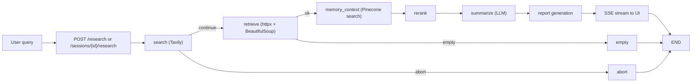
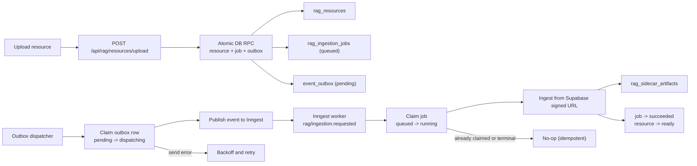

# Cortex

Production-grade AI research and RAG orchestration platform built with LangGraph, FastAPI, Inngest, and Supabase.


## What it does

Cortex runs multi-step web research workflows, streams progress in real time, generates structured reports, and supports grounded follow-up chat over retrieved sources. It also includes a reliable asynchronous ingestion pipeline for user-uploaded RAG resources.

## Signature capabilities

- Stateful LangGraph orchestration with explicit routing for success, empty, and failure paths.
- Streaming research execution over SSE for responsive UX during long-running workflows.
- Session-scoped research history and follow-up chat grounded to per-run source chunks.
- Durable ingestion pipeline with transactional outbox, dispatcher, and idempotent workers.
- End-to-end observability with trace spans across graph nodes and external dependencies.

## Stack and tools

- Orchestration: `LangGraph`
- API and streaming: `FastAPI`, `Uvicorn`, Server-Sent Events (SSE)
- LLM and agent layer: `LangChain`, `OpenAI`, `OpenRouter`, `Ollama`
- Web research and parsing: `Tavily`, `httpx`, `BeautifulSoup`
- Retrieval and reranking: `Pinecone`
- Async jobs and event delivery: `Inngest`, transactional outbox dispatcher
- Auth, sessions, and storage: `Supabase` (Postgres, Auth, Storage)
- Frontend: `React 19`, `Vite`, `TypeScript`, `react-markdown`
- Observability: `LangSmith`, `LangFuse`
- Quality tooling: `pytest`, `ruff`, `mypy`, `ESLint`

## Architecture

### Research execution flow



### Reliable ingestion flow (outbox pattern)



## Run locally

1) Install dependencies and configure environment:

```bash
uv sync
cp .env.example .env
```

Relevant LLM settings:

- `LLM_PROVIDER=openai|openrouter|ollama`
- `OPENAI_API_KEY` and `OPENAI_MODEL` for direct OpenAI usage
- `OPENROUTER_API_KEY` and `OPENROUTER_MODEL` for OpenRouter-hosted models
- `OLLAMA_BASE_URL` and `OLLAMA_MODEL` for local Ollama usage

2) Start backend API:

```bash
uv run python -m src.main serve --reload
```

3) Start frontend UI:

```bash
cd ui
npm install
npm run dev
```

4) Start event + ingestion workers:

```bash
# Terminal A: Inngest dev server
npx --ignore-scripts=false inngest-cli@latest dev -u http://127.0.0.1:8000/api/inngest --no-discovery

# Terminal B: Outbox dispatcher loop
while true; do uv run python -m src.main rag-dispatch-outbox --limit 100; sleep 2; done
```

## API surface

Key endpoints:

- `GET /health` - liveness check.
- `POST /research` - sessionless research run with SSE streaming.
- `POST /sessions` - create authenticated session.
- `GET /sessions` - list authenticated user sessions.
- `POST /sessions/{id}/research` - run research in-session with SSE streaming.
- `POST /sessions/{id}/runs/{run_id}/feedback` - submit thumbs feedback (optional comment) for a completed run.
- `POST /sessions/{id}/followup` - grounded follow-up chat over run sources.

Example research request:

```bash
curl -N -X POST http://localhost:8000/research \
  -H "Content-Type: application/json" \
  -d '{"query": "What is LangGraph?", "use_vector_store": false}'
```

## Best practices implemented

- Transactional outbox for exactly-once intent before external dispatch.
- Idempotent job claiming to prevent duplicate ingestion under retries.
- Concurrent-safe state transitions for outbox dispatch and ingestion jobs.
- Auth-scoped session boundaries for data isolation across users.
- Stream-first API design for long-running AI workflows.
- Structured observability across orchestration nodes and dependency calls.

## LangFuse integration

Cortex keeps `LangSmith` for graph/workflow-level tracing and adds `LangFuse` for generation-level observability, user scoring, and evaluation datasets.

Check more on [LANGFUSE.md](LANGFUSE.md).

## Development checks

```bash
uv run pytest -v
uv run ruff check src
uv run mypy src
```

## Model evaluation

The repo includes a standalone summarize-only comparison script at
`src/evals/model_comparison.py`.

- It loads sample cases from `src/evals/golden_set.json`
- It runs `summarize_node` directly for each configured `{provider, model}` entry
- It scores outputs with DeepEval faithfulness and answer relevancy metrics
- It writes results to `src/evals/results.csv`

Edit the `MODEL_CONFIGS` list in `src/evals/model_comparison.py` to choose which
OpenAI and Ollama models to compare.

Run it with:

```bash
uv run python3 src/evals/model_comparison.py
```

This script requires the credentials and local runtime for whichever providers
you list in `MODEL_CONFIGS`.
