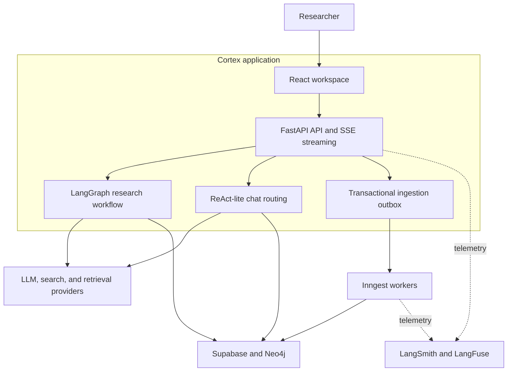
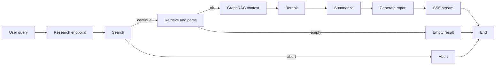
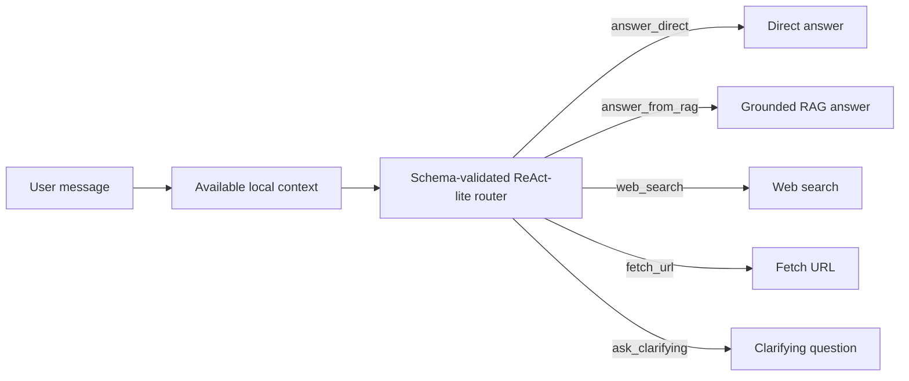
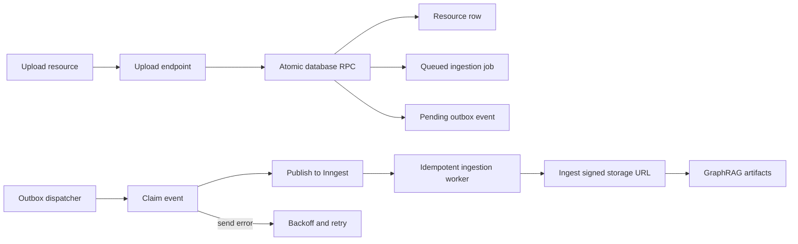

# Architecture

Cortex is a stateful research and retrieval platform built around four cooperating paths: research execution, routed chat, asynchronous resource ingestion, and session-scoped persistence.

## System context

## Research execution

Search, retrieval, memory context, reranking, summarization, and report generation are separate graph nodes. The graph represents empty and aborted execution explicitly instead of collapsing every non-happy path into a generic exception.

## Chat routing

Routing policy:

- Greetings and other social turns normally resolve directly.
- Weak or empty RAG context does not automatically trigger web search.
- Web search is selected for external, fresh, or otherwise web-dependent information.
- A URL in the message or history is available context, not an automatic fetch instruction.
- Direct URL fetching happens only when inspecting the resource is necessary.
- Agent chat, workspace chat, and streaming/non-streaming endpoints use the same policy.

The workspace-wide document collection is deny-by-default: Cortex retrieves it only when the router explicitly selects `answer_from_rag`. A custom agent's linked resources and session attachments are explicitly scoped resources, so they remain available on every turn. A routing failure after one structured-output repair returns `router_error` and does not retrieve documents.

## Reliable ingestion

Resource creation, job creation, and the intent to publish are committed together. The dispatcher claims outbox rows before publishing to Inngest, and the worker claims a queued job before processing it. Retries therefore preserve the event intent without allowing duplicate workers to process the same terminal job.

## Persistence and isolation

- Supabase provides Postgres persistence, authentication, and object storage.
- Research sessions and retrieved context are scoped to the authenticated user.
- Neo4j stores document chunks, vector embeddings, and graph relationships used for retrieval.
- Redis accelerates auth, search, and session hot paths but degrades gracefully when unavailable.

## Key engineering decisions

### Transactional outbox instead of direct dispatch

A direct `database write → queue API call` creates a dual-write failure window: the process can crash after saving the job but before publishing its event. Cortex records the resource, job, and outbox intent in one Supabase transaction. A separate dispatcher publishes and retries independently, avoiding a distributed transaction between Postgres and Inngest.

### Model-directed routing instead of fixed heuristics

Whether a turn needs RAG, the web, a URL fetch, clarification, or no tool at all depends on intent and conversation context. A validated model decision keeps that policy consistent across chat surfaces. The optional fine-tuned router can offload this frequent classification step to a smaller model; see [Router fine-tuning](router-fine-tuning.md).

### Explicit graph outcomes instead of a linear pipeline

An empty search result is not the same as a crashed provider call. Explicit graph edges preserve the distinction so the API, UI, and telemetry can report accurate outcomes and recovery behavior.

## Related documentation

- [Getting started](getting-started.md)
- [Production deployment](deployment.md)
- [Observability](observability.md)
- [Model evaluation](model-evaluation.md)
- [UI design system](../ui/DESIGN.md)
