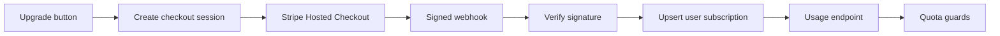

# Billing

Cortex uses Stripe Hosted Checkout, signed webhooks, and the customer portal for subscription management.

## Configuration

Required variables:

- `STRIPE_SECRET_KEY`
- `STRIPE_WEBHOOK_SECRET`
- `STRIPE_PRO_PRICE_ID`
- `STRIPE_SUCCESS_URL`
- `STRIPE_CANCEL_URL`
- `STRIPE_PORTAL_RETURN_URL`

Store production secret values in Google Secret Manager. See [Production configuration](env-vars-production.md).

## Webhook setup

Register the endpoint in **Stripe Dashboard → Developers → Webhooks**:

```text
https://<cloud-run-url>/api/billing/webhook
```

Subscribe to:

- `checkout.session.completed`
- `customer.subscription.created`
- `customer.subscription.updated`
- `customer.subscription.deleted`

The signing secret shown by Stripe must match `STRIPE_WEBHOOK_SECRET` in Secret Manager.

## Subscription flow



Webhook events are the authoritative source for subscription state. The backend verifies the Stripe signature before updating `user_subscriptions`; research and chat quota guards then read the synchronized subscription and usage state.

